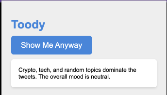

## Toody: Make Twitter Positive Again
Toody is a Chrome extension designed to enhance your Twitter experience by hiding the complete timeline unless its overall mood is positive. It provides a summary of the general vibes of your timeline, allowing you to pause and think if you want to jump in or maybe get back to work instead. If you decide to view the timeline anyway (if it's less than positive), Toody offers an option to display it.



### Features
Hide your main Twitter timeline by default

Analyze and display the timeline only if its overall mood is positive

Provide a summary of the general vibes of your timeline

Option to show the timeline even if it's not positive

### Installation
Follow these steps to include Toody in your Chrome browser:

Clone this repository to your local machine:

Copy code
```bash
git clone https://github.com/bartolkaruza/toody.git
```

To use Toody, you'll need to provide your own OpenAI API key for mood analysis. Follow these steps to input your API key:

Open the popup.js file in the toody folder.

Locate the following line at the beginning of the file:

Copy code
```javascript
const OPENAI_API_KEY = "your_api_key_here";
```
Replace "your_api_key_here" with your OpenAI API key in double quotes. For example:

Copy code
```javascript
const OPENAI_API_KEY = "abcdefgh1234567890";
```
Save the popup.js file.


Now, Toody will use your OpenAI API key to analyze the mood of your Twitter timeline.

Open Google Chrome and navigate to chrome://extensions/.

Enable "Developer mode" by clicking the toggle switch on the top right corner of the extensions page.

Click the "Load unpacked" button and select the cloned toody folder.

The Toody extension should now appear in your list of extensions. You can click the Toody icon in the top right corner of your browser to access the extension popup.

### Usage
Click the Toody icon in the top right corner of your Chrome browser to open the popup.

By default, your main Twitter timeline will be hidden, and only displayed if its overall mood is positive.

To view a summary of the general vibes of your timeline, click the "Show Summary" button in the popup.

If you wish to show the main timeline regardless of its mood, click the "Show Timeline Anyway" button in the popup.

Enjoy a more thoughtful and positive Twitter experience with Toody!
